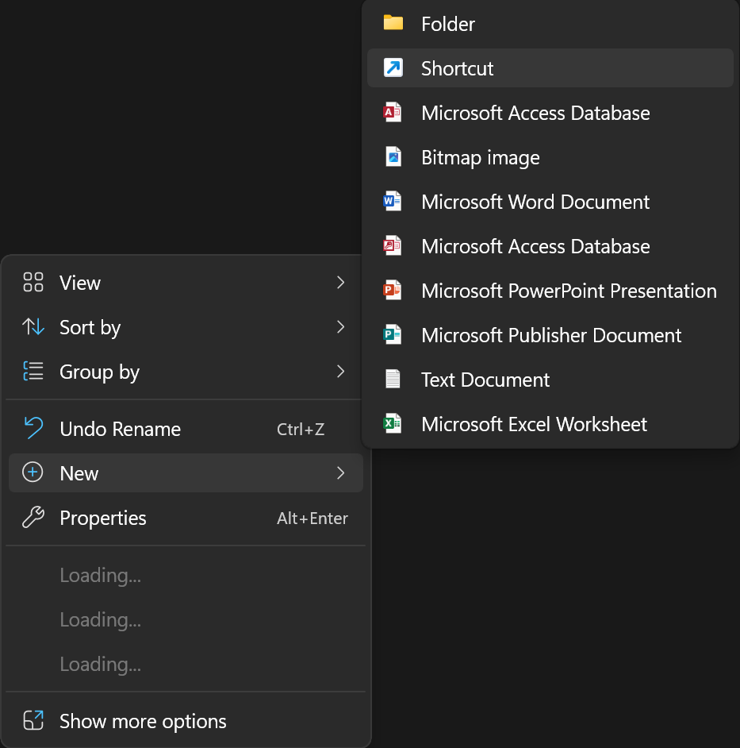
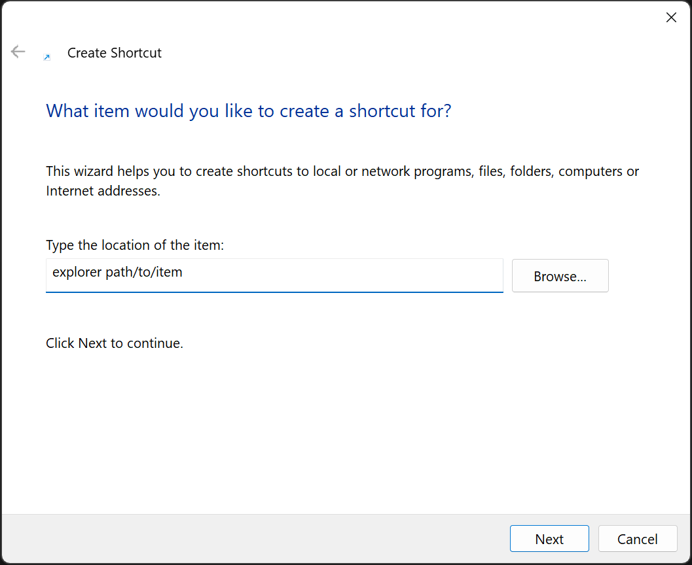
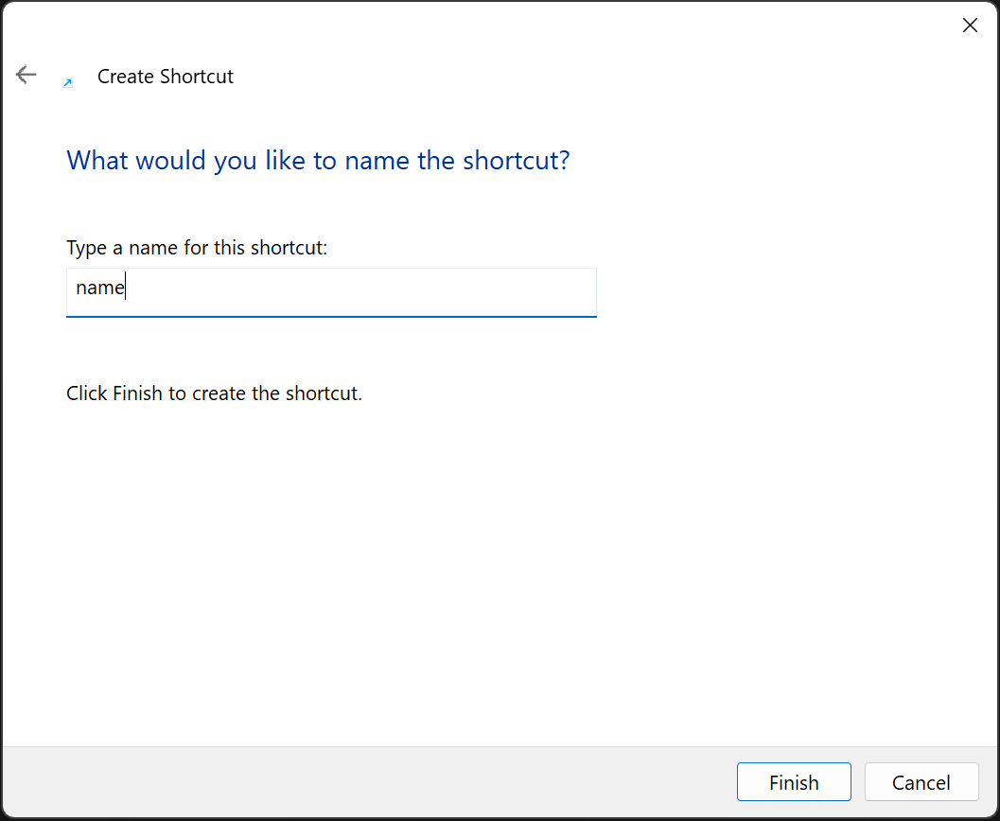
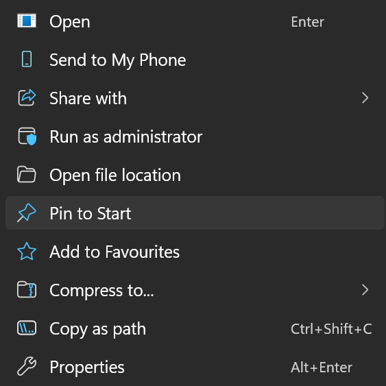
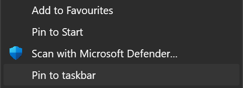
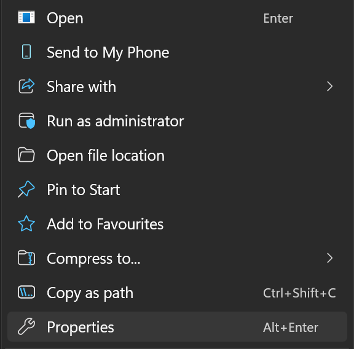
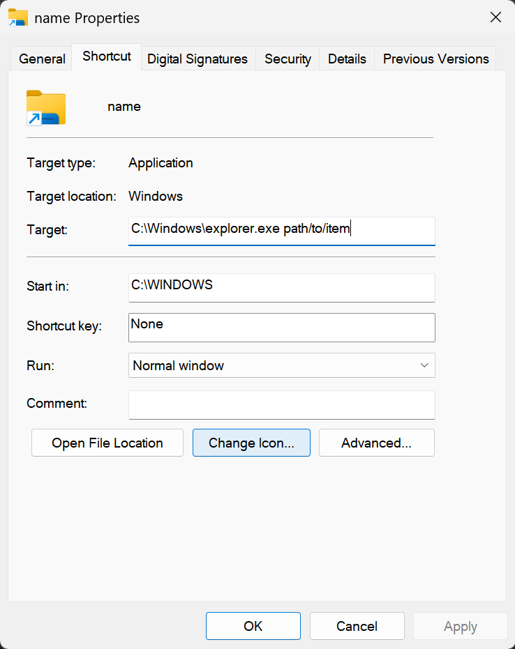
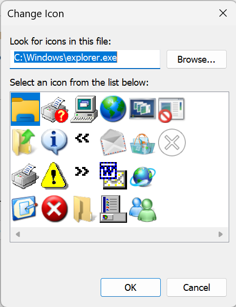
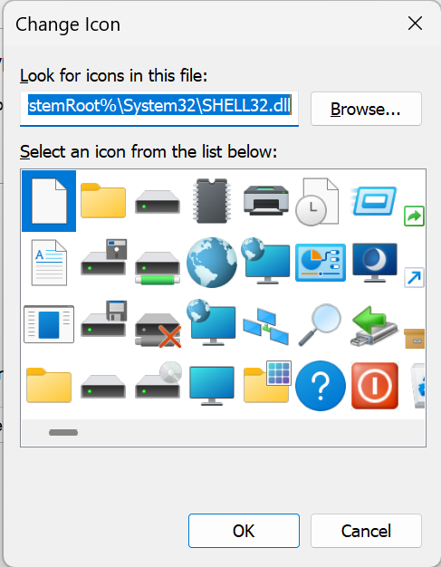

# Pin Shortcut to Start or Taskbar Windows 11

## Introduction

Normally, Windows 11 does not allow shortcuts to be pinned to the Start Menu or the Taskbar for convenient access.

This is a quick guide using a work around to create and customise a shortcut that can be pinned.

## Guide

### 1. Open File Explorer
### 2. Create new shortcut

1. Right click on empty space and select `New` followed by `Shortcut`.

### 3. Link explorer and path to item

1. Under `Type the location of the item`, type:

Example:

    explorer path/to/item

> [!NOTE]
> Replace `path/to/item` with the location of the item you want to access

| Item | Description |
| --- | --- |
| `explorer` | Links to File Explorer. This makes the system to treat the shortcut like the application, allowing it to be pinned. |
| `path/to/item` | The location of the item you want to access. |

### 4. Finish creating shortcut

1. Click `Next`
2. Name the shortcut with the name you want to be displayed

3. Click `Finish`

### 5. Pin shortcut

**A. Pin to Start Menu**

1. Right click on the shortcut and select `Pin to Start`

**B. Pin to Taskbar**

1. Right click on the shortcut and select `Show more options` followed by `Pin to Taskbar`

### 6. Customise shortcut icon (Optional)

1. Right click on the shortcut and select `Properties`

2. Click `Change Icon`

3. Select icon

For more icon options, under `Look for icons in this file:`, type:

Example:

    %SystemRoot%\System32\SHELL32.dll

> [!NOTE]
> You may need to tap the Enter key on your keyboard to reload the icon options.

4. Click `Ok` to save changes.